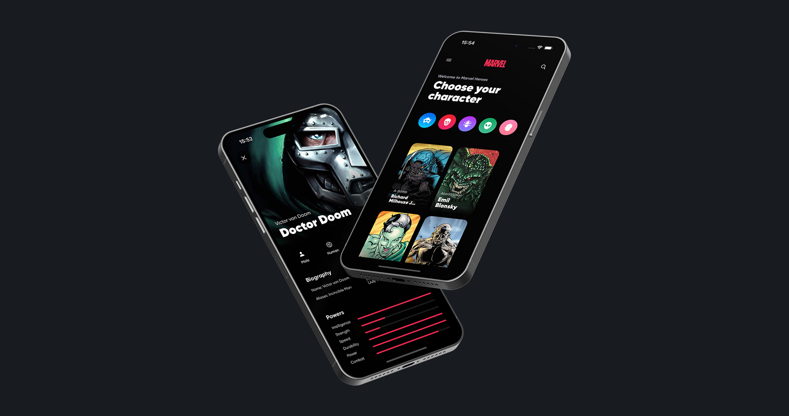

# Marvel Hero App

**Marvel Hero App** — это демонстрационное iOS-приложение, разработанное на Swift с использованием SwiftUI и Swift Concurrency, которое позволяет пользователям просматривать информацию о героях Marvel. Приложение получает данные из внешнего API, предоставляет функции поиска и фильтрации по различным категориям, а также отображает детальную информацию о каждом герое. Проект построен на архитектурном паттерне Model-View-Intent (MVI) для обеспечения чистого, реактивного и масштабируемого кода.

## Возможности
<details>
<summary> Details (Click to expand) </summary>
  <br>

  - **Список Героев:** Отображение всех доступных героев Marvel в удобной сетке.
  - **Поиск:** Мгновенный поиск героев по имени или полному имени.
  - **Фильтрация по Категориям:** Фильтрация героев по предопределенным категориям (Герои, Злодеи, Антагонисты, Инопланетяне, Люди) на основе их биографических данных.
  - **Детальный Профиль Героя:** Просмотр подробной информации о каждом герое, включая характеристики, внешность и биографию.
  - **Кэширование Данных:** Использование кэша для более быстрой загрузки данных и уменьшения сетевого трафика.
  - **Обработка Ошибок:** Информативное отображение сетевых ошибок через модальные окна.
  - **Скелетный Экран:** Плавный пользовательский опыт во время загрузки данных с помощью анимированных скелетных экранов.
  - **MVI Архитектура:** Чистое разделение ответственности и реактивное управление состоянием.
</details>

## Архитектура
<details>
  <summary> Details (Click to expand) </summary>

  Проект строго следует принципам MVI, что обеспечивает однонаправленный поток данных и предсказуемое управление состоянием:

  - **Intent:** Представляет действия пользователя или события, которые могут изменить состояние приложения.
  - **State:** Неизменяемая структура, которая описывает текущее состояние пользовательского интерфейса. Все изменения UI происходят в ответ на изменения State.
  - **Store:** Центральный компонент, который принимает `Intent`, обрабатывает их (выполняя бизнес-логику, сетевые запросы, кэширование), и обновляет `State`. `View` подписывается на изменения `State` в `Store`.
  - **View:** Отображает пользовательский интерфейс на основе текущего `State` и отправляет `Intent` в `Store` в ответ на взаимодействие пользователя.
</details>

## Структура проекта
<details>
  <summary> Details (Click to expand) </summary>

  ```bash
    Marvel Hero/
  ├── Core/
  │   ├── Data/
  │   │   ├── Cache/           # Сервис кэширования данных
  │   │   ├── Models/          # Модели данных
  │   │   └── Network/         # Сетевой слой
  │   └── UI/
  │       └── Extensions/      # Расширения для View
  ├── Features/
  │   ├── Delegate/            # Делегаты приложения
  │   ├── Hero/
  │   │   ├── Category/        # Компоненты, связанные с категориями
  │   │   ├── Components/      # Переиспользуемые UI-компоненты
  │   │   ├── Menu/            # Компоненты меню
  │   │   ├── HeroIntent.swift # Определения интентов
  │   │   ├── HeroState.swift  # Определения состояний
  │   │   ├── HeroStore.swift  # Основной Store для логики героев
  │   │   └── HeroView.swift   # Основной View для отображения героев
  │   └── ...
  ├── Supporting/              # Ресурсы (Assets.xcassets, Info.plist)

   MarvelHeroTests/            # Юнит-тесты
      └── HeroStoreTests.swift # Тесты для HeroStore
  ```
</details>

## 🤝 Contact
Если у вас возникли вопросы, касательно проекта - напишите мне на почту: ikrom921@gmail.com

## 🔖 License
Этот проект распространяется под лицензией MIT. Подробности см. в файле `LICENSE`.
